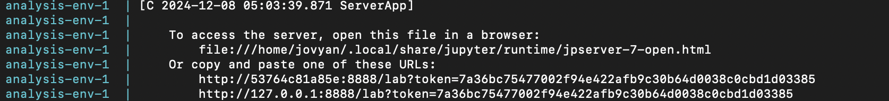

# DSCI522-2425-28-rental-bike-prediction
## Seoul Bike Share Predictor
- Author: Elaine Chu, Lukman Lateef, Dhruv Garg, Eugene You & Shawn Xiao Hu

This data analysis project is about the prediction of rental bikes in the Metro city of Seoul.

## About The Project

Currently Rental bikes are introduced in many urban cities for the enhancement of mobility comfort. It is important to make the rental bike available and accessible to the public at the right time as it lessens the waiting time. Eventually, providing the city with a stable supply of rental bikes becomes a major concern. The crucial part is the prediction of bike count required at each hour for the stable supply of rental bikes.

The data set that was used in this project is dataset contains count of public bicycles rented per hour in the Seoul Bike Sharing System, with corresponding weather data and holiday information created by Sathishkumar V E, Jangwoo Park, Yongyun Cho, "Using data mining techniques for bike sharing demand prediction in Metropolitan city", Computer Communications. It was sourced from the UCI Machine Learning Repository (Dua and Graff 2017) and can be found [here](https://archive.ics.uci.edu/dataset/560/seoul+bike+sharing+demand).

## Report

The comprehensive report and the analysis of the Seoul Bike Share Prediction can be found [here](https://ubc-mds.github.io/DSCI522-2425-28-rental-bike-prediction/index.html).

## Dependencies
- [Docker](https://www.docker.com/) 
- [Jupyter Lab](https://jupyter.org/install) (Version 4.2.4 or Higher)
- [Conda Lock](https://github.com/conda/conda-lock) (Version 2.5.7 or Higher)
- [Conda](https://anaconda.org/anaconda/conda) (Version 24.9.1 or Higher)

## Usage

### Setup

> If you are using Windows or Mac, make sure Docker Desktop is running.

1. Clone this GitHub repository.

### Running the analysis

1. Navigate to the root of this project on your computer using the
   command line and enter the following command:

``` 
docker compose up
```

2. In the terminal, look for a URL that starts with 
`http://127.0.0.1:8888/lab?token=` 
(for an example, see the highlighted text in the terminal below). 
Copy and paste that URL into your browser.




3. To run the analysis, open a terminal in JupyterLab and run the following commands sequentially:

```bash
python scripts/data_loading_n_validation.py \
    --url="https://archive.ics.uci.edu/static/public/560/seoul+bike+sharing+demand.zip" \
    --write_to=data/raw

python scripts/split_n_preprocessing.py \
    --raw_data=data/raw/SeoulBikeData.csv \
    --data_to=data/processed \
    --preprocessor_to=results/models \
    --seed=522
	
python scripts/eda.py \
    --processed_training_data=data/processed/bike_train.csv \
    --plot_to=results/figures --table_to=results/tables

python scripts/fit_rental_bike_prediction.py \
    --training-data=data/processed/bike_train.csv \
    --preprocessor=results/models/bike_preprocessor.pickle \
    --pipeline-to=results/models \
    --seed=522

python scripts/evaluate_rental_bike_prediction.py \
    --test-data=data/processed/bike_test.csv \
    --pipeline-from-ridge=results/models/ridge_pipeline.pickle \
    --pipeline-from-tree=results/models/tree_pipeline.pickle \
    --results-to=results/tables \
    --seed=522 \
    --plot_to=results/figures

quarto render report/rental_bike_prediction.qmd --to html
quarto render report/rental_bike_prediction.qmd --to pdf
```


### Clean up

1. To shut down the container and clean up the resources, 
type `Cntrl` + `C` in the terminal
where you launched the container, and then type `docker compose rm`

### Adding a new dependency

1. Add the dependency to the `environment.yml` file on a new branch.

2. Run `conda-lock -k explicit --file environment.yml -p linux-64` to update the `conda-linux-64.lock` file.

2. Re-build the Docker image locally to ensure it builds and runs properly.

3. Push the changes to GitHub. A new Docker
   image will be built and pushed to Docker Hub automatically.
   It will be tagged with the SHA for the commit that changed the file.

4. Update the `docker-compose.yml` file on your branch to use the new
   container image (make sure to update the tag specifically).

5. Send a pull request to merge the changes into the `main` branch. 


## License

The Seoul Bike Share Predictor software code contained in this project are licensed under MIT license. See the [licence file](https://github.com/UBC-MDS/DSCI522-2425-28-rental-bike-prediction/blob/main/LICENSE) here for more information. The project report is licensed under [Attribution-NonCommercial-ShareAlike 4.0 International (CC BY-NC-SA 4.0)](https://creativecommons.org/licenses/by-nc-sa/4.0/) License. See the license file for more information. For proper referencing, when re-using any part of this code and/or report, please include the link to this webpage.

## References

Dua, Dheeru, and Casey Graff. 2017. “UCI Machine Learning Repository.” University of California, Irvine, School of Information; Computer Sciences. (https://archive.ics.uci.edu/).

Sathishkumar V E, Jangwoo Park, Yongyun Cho, "Using data mining techniques for bike sharing demand prediction in Metropolitan city", Computer Communications, vol. 153, pp. 353-366, 2020. 

Sathishkumar V E, Yongyun Cho, "A rule-based model for Seoul Bike sharing demand prediction using Weather data", European Journal of Remote Sensing, Vol. 52, no. 1, pp. 166-183, 2020.
